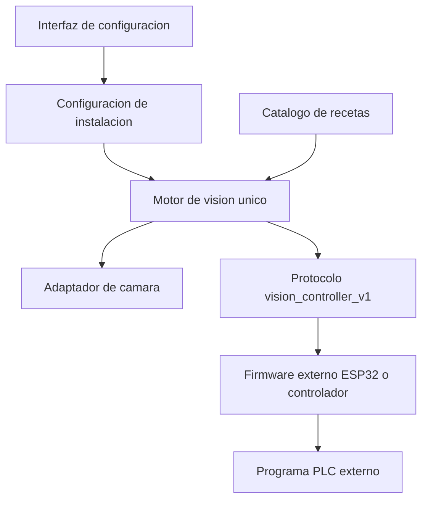

# Arquitectura del motor de vision universal

## Regla principal

El repositorio contiene una sola aplicacion. No existen perfiles de producto o
de maquina dentro del codigo. Cada Raspberry selecciona un archivo completo de
instalacion mediante `VISION_SYSTEM_CONFIG`; ese archivo referencia su catalogo
de recetas.

## Responsabilidades

| Elemento | Pertenece al motor | Pertenece a la instalacion |
|---|---:|---:|
| Pipeline, estados de resultado y validacion | Si | No |
| Contrato de herramientas y condiciones | Si | No |
| Protocolo serial `vision_controller_v1` | Si | No |
| Dispositivo, resolucion y FPS de camara | No | Si |
| Puerto serial y mapa identificador-receta | No | Si |
| Recetas, modelos, ROI, enfoque y parametros | No | Si |
| Reglas fisicas de sensores y actuadores | No | Firmware/PLC |
| Ladder y firmware ESP32 | No | Proyecto externo |

Worksurface sera una instalacion del motor, no un perfil, modulo ni rama de
ejecucion dentro de la aplicacion. Sus modelos, codigos, sensores y tiempos se
definiran fuera del nucleo.

## Archivos de configuracion

- `config/system.json`: configuracion base de una instalacion.
- `core/models/recipes.json`: catalogo actual; se migra automaticamente al
  esquema v3 al abrirlo.
- `VISION_SYSTEM_CONFIG`: ruta opcional a otro archivo completo de instalacion.

La seleccion por variable de entorno cambia datos, no comportamiento del
programa. El protocolo no es seleccionable: cualquier firmware compatible debe
implementar `vision_controller_v1`.

## Alcance de esta correccion

- retira `active_profile`, `profiles` y `VISION_PROFILE`;
- retira las recetas Worksurface incluidas en el motor;
- acepta identificadores externos arbitrarios y los mapea a recetas;
- conserva multiples instancias de una herramienta mediante `step.id`;
- agrega condiciones declarativas de paso;
- migra recetas heredadas al esquema universal v3 con respaldo `.bak`;
- conserva identificador de ciclo, heartbeat, READY/NOT_READY, ACK tipado,
  cancelacion y rechazo de resultados tardios;
- no incluye ni modifica firmware ESP32 o programas PLC.

## Trabajo posterior de interfaz

El archivo ya es la fuente de verdad. La interfaz debe exponer gradualmente las
mismas secciones sin crear otra estructura paralela:

1. camara y modo de enfoque;
2. catalogo de recetas/modelos;
3. pasos, herramienta, parametros, requerido/habilitado y condicion;
4. mapa de identificadores externos a recetas;
5. validacion, vista previa y activacion de una receta comisionada.

La primera version del editor universal cubre los puntos 1 a 4 y el
comisionamiento validado. Los cambios de instalacion requieren reinicio y
mantienen el motor en `NOT_READY` hasta aplicarse. Consulte
`docs/universal_configuration_ui.md`.

La fase 4 agrega el contrato unico de ROI, estados tipados de herramientas,
deadline global de inspeccion y cancelacion cooperativa. Ninguna de estas
reglas contiene logica especifica de una maquina.

## Catalogo de herramientas

Las clases concretas de `ToolBase` se descubren desde el paquete `tools`. Cada
una publica un ID, schema, defaults, reglas de comisionamiento y recursos. El
mismo `ToolRegistry` alimenta pipeline, recetas, diagnostico y editor; `app.py`
no mantiene una lista manual. Consulte `docs/tool_framework.md` para el
contrato de extension y sus pruebas obligatorias.
